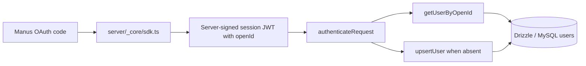

# التدقيق الثابت الشامل: الهوية وSupabase ومسارات البيانات — ClinPharm Hospital

> **نطاق التقرير:** دليل مستودع GitHub ثابت فقط. لم يُشغَّل التطبيق، ولم يُفتح متصفح، ولم تُنفَّذ طلبات Supabase أو SQL أو OAuth، ولم تُقرأ أي أسرار. لذلك تشير عبارة **VERIFIED** هنا إلى وجود دليل صريح في الملفات المتتبعة، لا إلى سلوك runtime.

## 1. النطاق والفروع والملفات المفحوصة

شمل التدقيق فرعي GitHub ذوي الصلة: `main` و`feature/clinpharm-audit-report`. الفرق بين فرع التدقيق و`main` يقتصر على وثائق التدقيق؛ وعليه فإن الدليل البرمجي أدناه مشترك بينهما ضمن هذا النطاق.

| نطاق الملفات | أمثلة مفحوصة | الغرض |
|---|---|---|
| الإعداد والحزم | `package.json`, `vite.config.ts`, `template.json`, `.github/workflows/verify.yml` | تحديد مكتبات Supabase وtRPC ومسارات النشر/الفحص |
| الواجهة وhooks | `client/src/pages/Home.tsx`, `client/src/components/WorkspaceFeature.tsx`, `client/src/hooks/useCloudPatients.ts`, `client/src/hooks/useCloudClinicalRecords.ts` | تتبع UI → hook → repository |
| عميل Supabase والمستودعات | `client/src/lib/supabase/client.ts`, `auth.ts`, `patientRepository.ts`, `clinicalRepository.ts`, `syncQueue.ts` | المصادقة، CRUD، مصدر `owner_id`، والطابور |
| الخادم وtRPC | `server/routers.ts`, `server/_core/context.ts`, `server/_core/sdk.ts`, `server/db.ts` | مسار Manus OAuth ووجود/غياب إجراءات سريرية على الخادم |
| المخطط والاختبارات | `supabase/schema.sql`, `drizzle/schema.ts`, اختبارات Supabase المتتبعة | الجداول، RLS، وادعاءات الاختبارات الثابتة |
| LLM | `server/_core/llm.ts` | خطر تمرير محتوى سريري/PHI |

## 2. الملخص التنفيذي

| السؤال | النتيجة الثابتة | التصنيف |
|---|---|---|
| هل يوجد Supabase client؟ | نعم، client واحد في الواجهة باستخدام مفاتيح عامة فقط. | **VERIFIED** |
| هل توجد CRUD للكيانات السريرية في runtime code؟ | نعم، الواجهة تستدعي مستودعات Supabase مباشرة من hooks؛ لا تمر الإجراءات السريرية عبر tRPC. | **VERIFIED** |
| هل يوجد mapping مستودعي بين Manus `openId` و`auth.users.id`؟ | لم يُعثر على mapping أو provisioning في الشفرة المتتبعة. | **UNVERIFIED** runtime؛ **LIKELY CONFLICT** معماريًا |
| ما مصدر `owner_id` في عمليات CRUD؟ | `supabase.auth.getSession().data.session.user.id` داخل hooks، ثم يُرسل إلى المستودعات. | **VERIFIED** |
| هل يثبت ذلك أن `owner_id = auth.uid()` وقت التشغيل؟ | لا؛ يلزم جلسة Supabase حقيقية وفحص RLS. | **UNVERIFIED** |
| هل توجد service-role usage في شفرة الإنتاج المتتبعة؟ | لم يُعثر على usage؛ المطابقة الوحيدة assertion سلبي داخل اختبار. | **VERIFIED** static-only؛ runtime **UNVERIFIED** |
| هل `sync_queue` جدول Supabase مستعمل في runtime؟ | المخطط يعرّفه، لكن الطابور runtime محفوظ في `localStorage` ولا توجد repository calls للجدول. | **CONFLICT** |
| هل RLS يعزل المستخدمين فعليًا؟ | السياسة موجودة في SQL، لكن ALLOW/DENY لم يُثبت runtime. | **VERIFIED** policy text؛ runtime **UNVERIFIED** |

## 3. تهيئة Supabase والإعدادات

### 3.1 موقع تهيئة العميل

يوجد تهيئة واحدة لعميل Supabase في `client/src/lib/supabase/client.ts:1–13`. تستورد `createClient` من `@supabase/supabase-js` في السطر 1، وتقرأ عنوان المشروع من `EXPO_PUBLIC_SUPABASE_URL` مع fallback إلى `VITE_SUPABASE_URL` في السطر 4، وتقرأ مفتاح العميل العام من `EXPO_PUBLIC_SUPABASE_PUBLISHABLE_KEY` مع fallback إلى `VITE_SUPABASE_ANON_KEY` في السطر 5. لا يُنشأ client إذا غابت القيم، ويُنشأ في السطور 9–12 مع `persistSession`, `autoRefreshToken`, و`detectSessionInUrl`.

`@supabase/supabase-js` مثبت كاعتماد runtime في `package.json:51`. لا تظهر أي تهيئة server-side لـSupabase أو Admin client في `server/**` ضمن البحث المتتبع.

### 3.2 مراجع service-role

تم البحث في جميع ملفات المصدر والإعداد المتتبعة، باستثناء الوثائق وملف lock، عن: `service_role`, `SUPABASE_SERVICE_ROLE`, `SUPABASE_SERVICE_KEY`, و`SUPABASE_SERVICE_ROLE_KEY`.

| الموقع | النتيجة |
|---|---|
| `client/src/lib/supabase-live-config.test.ts:10` | assertion سلبي يتأكد أن المفتاح العام لا يحتوي وسم `service_role`. |
| بقية مصدر الإنتاج/الخادم المتتبع | لا توجد مطابقة لهذه المعرّفات. |

> لا يثبت غياب النص في المستودع غياب key أو service-role usage في بيئة نشر غير ظاهرة أو integration خارجي. ولذلك يظل سلوك runtime **UNVERIFIED**.

## 4. مسار Manus OAuth وDrizzle/MySQL

المسار الخادمي للهوية منفصل بوضوح عن عميل Supabase:



`server/_core/context.ts:11–27` يبني context الخاص بـtRPC عبر `sdk.authenticateRequest` ويحتفظ بمستخدم من نوع Drizzle `User`. `server/db.ts:21–89` يفرض وجود `openId`، ثم ينفذ `upsertUser` و`getUserByOpenId` في جدول MySQL. هذا يثبت أن server/tRPC يتعامل مع هوية Manus/Drizzle.

لم يُعثر في `server/**` على `@supabase/supabase-js` أو على Supabase Admin API أو على استدعاء ينشئ `auth.users` من معلومات Manus OAuth. لذا لا يوجد دليل مستودعي على أي من الأسهم التالية:

```text
Manus openId  ──X──>  Supabase auth.users.id  ──X──>  Supabase auth.uid()
```

**الاستنتاج:** المساران منفصلان في الدليل الثابت: Manus OAuth → session server → Drizzle/MySQL، وSupabase Auth → session client → `auth.uid()`/RLS. وجود integration خارجي غير متتبع يظل احتمالًا غير قابل للإثبات هنا. **LIKELY / UNVERIFIED**.

## 5. Supabase Auth في الواجهة

`client/src/lib/supabase/auth.ts:6–27` يعرف مسار Supabase Auth مستقلًا بالبريد وكلمة المرور: `signUp` في السطور 7–10، و`signInWithPassword` في 11–14، و`signOut` في 15–18، واستعادة كلمة المرور في 19–23، و`getSession` في 24–26. كما يعتمد `client/src/components/SupabaseAuthPanel.tsx` على هذه الطبقة لواجهة الدخول.

هذا دليل على أن التطبيق **يملك** طريقًا لإنشاء/الدخول إلى Supabase Auth من العميل. لكنه لا يثبت أن مستخدم Manus OAuth يدخل إلى هذا الطريق أو أن الجلستين تتطابقان. **VERIFIED** للشفرة؛ **UNVERIFIED** للربط runtime.

## 6. الجداول والمخطط وRLS

يعرف `supabase/schema.sql` الجداول التالية:

| الكيان | تعريف الملكية | سياسة RLS |
|---|---|---|
| `profiles` | `id → auth.users(id)` في `schema.sql:6–12` | `auth.uid() = id` في 99–104 |
| `clinical_patients` | `owner_id → auth.users(id)` في 14–26 | `auth.uid() = owner_id` في 106–107 |
| `clinical_cases` | `owner_id → auth.users(id)` في 28–37 | `auth.uid() = owner_id` في 108–109 |
| `medication_reviews` | `owner_id → auth.users(id)` في 39–49 | `auth.uid() = owner_id` في 112–113 |
| `clinical_interventions` | `owner_id → auth.users(id)` في 51–62 | `auth.uid() = owner_id` في 110–111 |
| `guidelines` | لا يوجد `owner_id` | قراءة عامة `using (true)` في 114–115 |
| `sync_queue` | `owner_id → auth.users(id)` في 75–84 | `auth.uid() = owner_id` في 116–117 |

يوجد trigger `on_auth_user_created` في `schema.sql:119–127` ينشئ صف `profiles` **بعد** إدخال صف في `auth.users`. لا ينشئ trigger مستخدمًا من `openId`، ولا توجد شفرة متتبعة تستدعي provisioning لـ`auth.users` من Manus OAuth.

### الجداول غير المعرّفة في هذا المخطط

المخطط الحالي لا يعرّف كيانات سريرية تفصيلية مثل encounters، diagnoses، allergies، medication history/orders، laboratory results، vital signs، drug-related-problem records، monitoring plans، أو audit logs. هذه **فجوة نطاق data model** مثبتة في `supabase/schema.sql`، وليست إثباتًا لمشكلة runtime.

## 7. مسارات CRUD الفعلية في الشفرة

### 7.1 المرضى

```mermaid
flowchart LR
  A[Home.tsx] --> B[useCloudPatients.createPatient]
  B --> C{supabase.auth.getSession]
  C --> D[ownerId = session.user.id]
  D --> E[patientRepository.create]
  E --> F[supabase.from clinical_patients insert]
```

`client/src/pages/Home.tsx:39,87,106` يربط الواجهة بـ`useCloudPatients` وينادي `createPatient`. في `client/src/hooks/useCloudPatients.ts:86–105` يستخرج hook `ownerId` من `supabase.auth.getSession()` في 87–89 ثم يستدعي `patientRepository.create(draft, ownerId)` في 98. يضيف `patientRepository.create` الحقل `owner_id: ownerId` في `client/src/lib/supabase/patientRepository.ts:13–17`، وينفذ insert مباشرًا إلى `clinical_patients`.

عند غياب session أو اتصال، ينشئ hook سجلًا محليًا يحمل `owner_id: "local"` في السطر 89 ويضعه في الطابور المحلي في 92–95. هذه القيمة لا تصل إلى جدول Supabase في مسار online المباشر؛ لاحقًا يمر flush بـ`ownerId` من session في 25–45. **VERIFIED** للشفرة؛ RLS runtime **UNVERIFIED**.

### 7.2 الحالات السريرية، التدخلات، والمراجعات

`client/src/components/WorkspaceFeature.tsx:29,43,47,49` يربط وحدات Cases وMedication review وInterventions بالـhook `useCloudClinicalRecords`.

| الكيان | UI / hook | Repository / العملية |
|---|---|---|
| `clinical_cases` | `WorkspaceFeature.tsx:49` → `useCloudClinicalRecords.createCase:28–32` | `clinicalRepository.cases.create:11–14` → direct `.from("clinical_cases").insert({... owner_id: ownerId})` |
| `medication_reviews` | `WorkspaceFeature.tsx:43` → `saveMedicationReview:34–38` | `clinicalRepository.medicationReviews.upsert:17–19` → direct `.upsert({... owner_id: ownerId})` |
| `clinical_interventions` | `WorkspaceFeature.tsx:47` → `createIntervention:45–49` و`updateIntervention:58–62` | `clinicalRepository.interventions.create/update:22–25` → direct insert/update مع filter `owner_id` |
| `guidelines` | `WorkspaceFeature.tsx:32,41` → `searchGuidelines:51–56` | `clinicalRepository.guidelines.search:27–29` → direct select من `guidelines` |

في `useCloudClinicalRecords.ts:14–26` يستخرج `sessionId` من `supabase.auth.getSession().data.session?.user.id` ثم يمرره إلى كل عمليات list/mutation. وهكذا يوجد دليل ثابت أن `owner_id` المدخل في CRUD مشتق من **Supabase Auth session**، وليس من `ctx.user.openId` أو tRPC.

### 7.3 Sync queue

`client/src/lib/supabase/syncQueue.ts:3–63` يخزن الطابور في `localStorage` تحت المفتاح `clinpharm-sync-queue`، ويطبق enqueue/flush/fail محليًا. `useCloudPatients.ts:25–45` يعيد تنفيذ عناصر الطابور مباشرة عبر `patientRepository` و`clinicalRepository`.

> **CONFLICT:** `public.sync_queue` معرّف ومؤمن بـRLS في `supabase/schema.sql:75–84,116–117`، لكن لا توجد repository/hook calls متتبعة إلى `.from("sync_queue")`. المسار المنفذ في الشفرة هو localStorage، وليس جدول Supabase.

## 8. خريطة tRPC → قاعدة البيانات

`server/routers.ts:6–28` يحتوي فقط على `system` و`auth.me` و`auth.logout`، مع TODO مثال غير منفذ. لا توجد إجراءات tRPC خاصة بـpatients أو cases أو medication reviews أو interventions أو guidelines أو sync queue.

| مجال | UI/hook | tRPC | Server adapter | قاعدة البيانات |
|---|---|---|---|---|
| Manus session / `auth.me` | `useAuth` / `trpc.auth.me` | موجود في `server/routers.ts:9–18` | `createContext` → `sdk.authenticateRequest` | Drizzle/MySQL users |
| Patients | `Home` → `useCloudPatients` | **لا يوجد** | **لا يوجد** | Supabase client → `clinical_patients` |
| Cases | `WorkspaceFeature` → `useCloudClinicalRecords` | **لا يوجد** | **لا يوجد** | Supabase client → `clinical_cases` |
| Medication reviews | `WorkspaceFeature` → `useCloudClinicalRecords` | **لا يوجد** | **لا يوجد** | Supabase client → `medication_reviews` |
| Interventions | `WorkspaceFeature` → `useCloudClinicalRecords` | **لا يوجد** | **لا يوجد** | Supabase client → `clinical_interventions` |
| Guidelines | `WorkspaceFeature` → `useCloudClinicalRecords` | **لا يوجد** | **لا يوجد** | Supabase client → `guidelines` |
| Sync queue | hooks → `syncQueue` | **لا يوجد** | **لا يوجد** | localStorage؛ لا توجد كتابة ثابتة للجدول `sync_queue` |

**الاستنتاج:** لا يوجد مسار ثابت `UI → tRPC → server → Supabase` للبيانات السريرية. المسار المثبت هو `UI → hook → client repository → Supabase PostgREST`. هذا ليس عيبًا بالضرورة، لكنه يتعارض مع توقع وجود server-side identity bridge أو server-side ownership assignment.

## 9. owner_id: مصدره وحدوده

| موضع التعيين | الدليل | التصنيف |
|---|---|---|
| عمليات مرضى online | `useCloudPatients.ts:87–99` ثم `patientRepository.ts:13–17` | **VERIFIED**: `session.user.id` يمرر إلى `owner_id` |
| عمليات الحالات/المراجعات/التدخلات | `useCloudClinicalRecords.ts:16–22,28–68` ثم `clinicalRepository.ts:11–25` | **VERIFIED**: `session.user.id` يمرر إلى `owner_id` |
| الـqueue المحلي قبل المصادقة | `useCloudPatients.ts:89–95` | **VERIFIED**: القيمة المحلية `local` لا تمثل UUID Supabase ولا تصل للكتابة online المباشرة |
| تطابق `owner_id` مع `auth.uid()` | يتطلب policy evaluation لجلسة حقيقية | **UNVERIFIED** |
| تطابق `owner_id` مع Manus `openId` | لا يوجد mapping مستودعي | **UNVERIFIED / LIKELY CONFLICT** |

## 10. LLM ومخاطر PHI

`server/_core/llm.ts:342–420` يقبل `messages` عامة ويحوّلها إلى payload ثم يرسلها عبر HTTP POST إلى Forge في السطور 404–410. لا توجد في هذا الملف طبقة ثابتة لتصنيف PHI أو إخفاء الهوية أو allowlist للحقول قبل الإرسال. كما أن أخطاء upstream يمكن أن تدخل نص response في خطأ محلي في 413–417.

**SECURITY RISK:** إذا مرر caller بيانات سريرية/PHI إلى `invokeLLM`، لا يثبت هذا الملف وجود de-identification قبل outbound transmission. لا يثبت التدقيق أن PHI يُرسل بالفعل؛ الخطر هو غياب حارس ثابت ظاهر في هذه الطبقة.

## 11. الاختبارات المتتبعة

توجد اختبارات Supabase متتبعة: `client/src/lib/supabase-auth.test.ts`, `supabase-config.test.ts`, `supabase-live-config.test.ts`, `supabase-sync.test.ts`, و`supabase/schema.test.ts`. تثبت هذه اختبارات منطق/تهيئة أو اتصالًا في بيئة اختبار عند تشغيلها، لكنها لا تثبت identity mapping أو RLS multi-user في هذا التقرير الثابت.

## 12. الاستنتاج المعماري النهائي

يوجد **مساران مصادقة منفصلان في الشفرة المتتبعة**:

1. **Manus OAuth path:** OAuth → server session JWT يحوي `openId` → Drizzle/MySQL user.
2. **Supabase clinical path:** Supabase email/password/session → `session.user.id` → client-provided `owner_id` → PostgREST/RLS.

لم يُعثر على code-level bridge يثبت أن `openId` يساوي أو يطابق `auth.users.id`، أو أن Manus login ينشئ Supabase session أو Supabase user. وفي المقابل، CRUD السريري ليس تعريف SQL فقط؛ إنه مستعمل مباشرة من runtime client code، لكن نجاحه الفعلي يعتمد على Supabase session وRLS لا يمكن إثباتهما من GitHub وحده.

## 13. الأسئلة التي تتطلب runtime فقط

| السؤال | لماذا لا يكفي التدقيق الثابت؟ |
|---|---|
| هل Manus OAuth login يولد `auth.users` أو Supabase session؟ | يمكن أن يحدث عبر إعداد خارجي أو middleware غير متتبع. |
| هل `session.user.id = auth.uid() = owner_id` فعليًا؟ | يتطلب جلسة Supabase وتشغيل policy داخل قاعدة البيانات. |
| هل RLS يسمح own-record ويرفض cross-user؟ | يتطلب مستخدمين staging موجودين ونتائج ALLOW/DENY. |
| هل service-role يستعمل في بيئة نشر؟ | المستودع لا يكشف secrets أو external integrations. |
| هل تصمد retry/conflict queue مع بيانات حقيقية؟ | يتطلب runtime/شبكة/حالة offline ومراقبة للنتيجة. |

## 14. حدود التغيير

هذا التحديث يعدّل وثيقة التدقيق فقط. لم يُعدّل تطبيق، إعداد نشر، Supabase schema، سياسة RLS، migration، مستخدم، أو بيانات سريرية.
